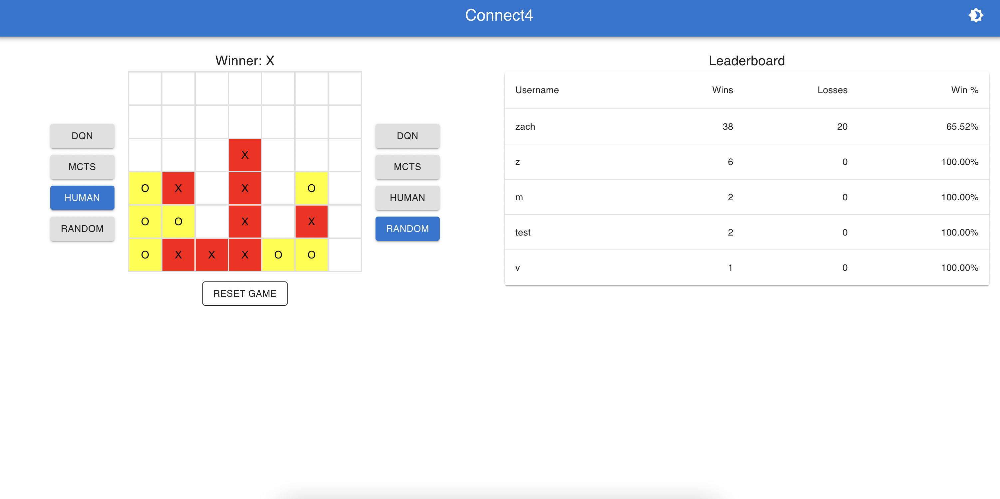

# Connect4 Game Application

## Overview
This Connect4 game is a full-stack web application that aims to replicate the classic Connect4 experience with additional features including various AI opponents and a leaderboard system.



## Features
- **Full-stack Connect4 Game**: A functional Connect4 game that can be played in a web browser.
- **Opponent Choice**: Switch your opponent at any time before, after, or during matches. 
- **Leaderboard**: A leaderboard that will track and display player rankings.

## Technology Stack
- **Frontend**: React, TypeScript, Material UI
- **Backend**: Python, Pydantic
- **Database**: PostgreSQL
- **API Calls**: Axios, FastApi
- **Containerization**: Docker, Docker Compose
- **DQN Agent**: Pytorch

## Installation and Running the Application

### Prerequisites
- Docker and Docker Compose installed on your machine.

### Running the Application
To run the application, you can navigate to docker folder and run:

```bash
docker compose up
```
Interact with the app by going to 'localhost:3000'.

If you want to run each service individually instead, you can run the following command for each service (frontend,backend,postgres):

```bash
docker compose up <service>
```

## Upcoming
- **Implementation of AI Agents**: Agents to be added include a Deep Q-Learning (DQN) agent, a Monte-Carlo Tree Search (MCTS) agent, and a Minimax with Alpha-Beta Pruning agent. 

## Possible Future Additions
- **Additional Games**: 
    - Primarily 2-player games
    - Each game will come with additional trained agents to play against.

## Just for Practice
- **CI/CD Pipeline**
- **Hosting on AWS**
- **Integrate Stripe**


