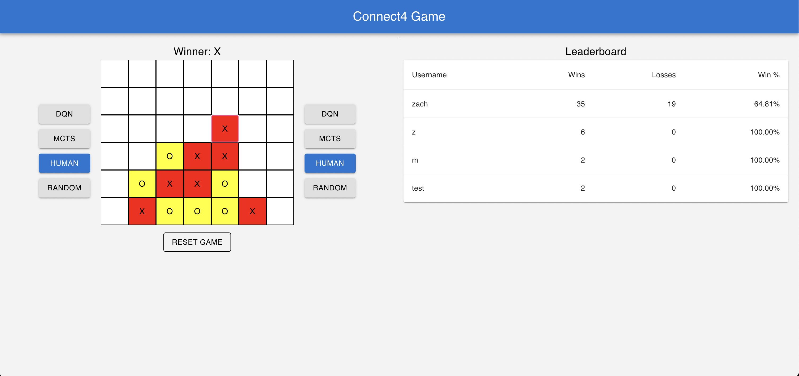

# Connect4 Game Application

## Overview
This Connect4 application is a full-stack web application built using React, TypeScript, and Python. It is containerized using Docker and Docker Compose, making it easy to run and deploy. The game aims to replicate the classic Connect4 experience with additional features, including various AI opponents and a leaderboard system.



## Features
- **Full-stack Connect4 Game**: A functional Connect4 game that can be played in a web browser.
- **AI Opponents**: Includes trained Deep Q-Network (DQN) agents, with ongoing improvements and additions such as Monte Carlo Tree Search (MCTS) agents and Minimax with Alpha-Beta Pruning agents.
- **Player Choice**: Players can choose to play against random agents, DQN, MCTS, Minimax with Alpha-Beta Pruning agents, or another human in a 1v1 match. 
- **Leaderboard**: A leaderboard that will track and display player rankings. Leaderboard per opponent type coming soon.

## Technology Stack
- **Frontend**: React, TypeScript
- **Backend**: Python
- **Database**: PostgreSQL
- **API Calls**: Axios, FastApi
- **Containerization**: Docker, Docker Compose
- **RL Agents**: Pytorch

## Installation and Running the Application

### Prerequisites
- Docker and Docker Compose installed on your machine.

### Running the Application
To run the application, you can start each service (backend, frontend, PostgreSQL) individually using Docker Compose. Use the following command to start a specific service:

```bash
docker-compose up <service>
